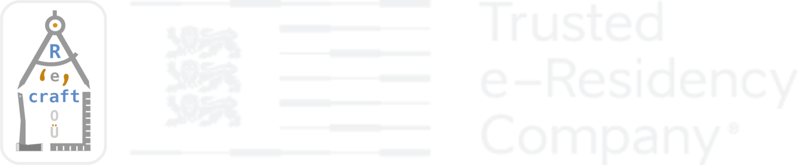

```{r setup, include=FALSE}
knitr::opts_chunk$set(echo = FALSE)

```


```{r preview=TRUE, layout = "l-body", out.extra="class=external"}


```

Recraft offers software consulting services in the following areas: 

- _*Recrafting existing R code*_ into an R package that can be distributed globally via GitHub or even through CRAN (if accepted there). Or even creating new custom R packages from scratch.
- _*Containerization*_ of existing IT systems using Free and Open Source Software (FOSS) tools and techniques so it can run in a modular and portable fashion in the cloud (or locally) as Docker containers.
- _*Modernization of Traditional Applications*_ - aka [MTA](https://goto.docker.com/MTAkit.html). This often involves a webification of current software applications that might presently be locked-in to a particular non-FOSS OS or platform. For example, it can mean converting a desktop application into a web application, so that it can run in the cloud, on the web (too).
- _*Cloudification*_ involving IaaS efforts with regards to for example deployment, maintenance and operations of cloud based software services 
