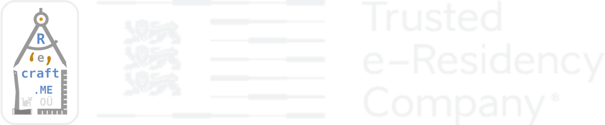

```{r setup, include=FALSE}
knitr::opts_chunk$set(echo = FALSE)

```


```{r preview=TRUE, layout = "l-body", out.extra="class=external"}
# library(magick)
# 
# image_append(stack = FALSE, c(
#   image_read("images/logo.png") %>%
#     image_trim %>% image_resize("x300"), #%>%
#     #image_background("transparent") %>%
#     #image_border("transparent", "18x18")
#   image_blank(40, 200, color = "transparent"),
#   image_read("images/TERC_logo_label_RGB_transparent.png") %>% image_trim %>% image_resize("x300")
# )) %>%
#   image_write("images/logo-index.png")


```

Recraft offers software consulting services in the following areas: 

- _*Recrafting existing R code*_ into an R package that can be distributed globally via GitHub or even through CRAN (if accepted there). Or even creating new custom R packages from scratch.
- _*Containerization or cloudification*_ of existing IT systems using Free and Open Source Software (FOSS) tools and techniques so it can run in a modular and portable fashion in the cloud (or locally) as Docker containers.
- _*Modernization of Traditional Applications*_ - aka [MTA](https://goto.docker.com/MTAkit.html) - often involving a webification of software applications that might presently be locked-in to a particular non-FOSS OS or platform. This can mean converting a desktop application into a web application, so that it can run in the cloud, on the web (too).
- _*IaaS efforts*_ involving deployment, maintenance and operations of cloud based software services 
